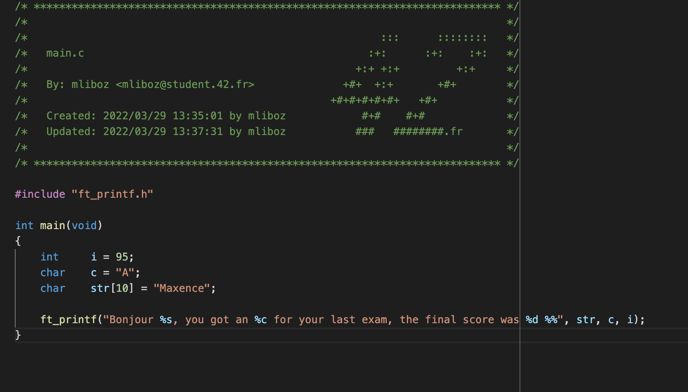
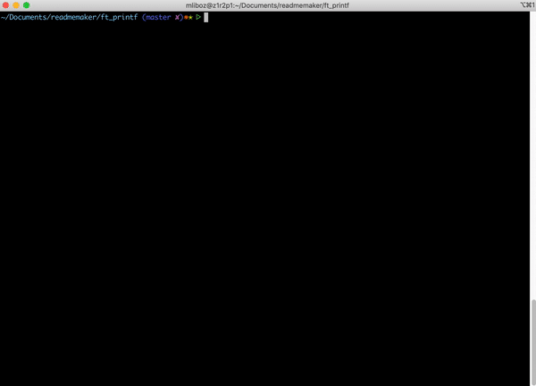

# ft_printf project at 42 school

### Create a function that copy the functionnality of the real printf.

ft_printf will be able to manage %c, %s, %d, %i, %u, %x, %X, %% convertions.

### What I learned:

* stdarg -> va_list, va_start, va_arg, va_end.
* Array of pointer to function.
* Manage undefined behavior from the real function.


# ft_printf
> Recreate a part of the printf function.

## Table of Contents
* [General Info](#general-information)
* [Technologies Used](#technologies-used)
* [Stdarg library](#stdarg-library)
* [Use examples](#use-examples)
* [Setup](#setup)
* [Usage](#usage)
* [Project Status](#project-status)
* [Room for Improvement](#room-for-improvement)
* [Contact](#contact)

## General Information
- The goal of this project is to re-create a part of the printf function
- In order to do that, we had to use the stdarg library, in order to implement  
the va_list.
- The purpose of this project is to really understand a new concept that is  
passing an undefined number of argument in a function.

## Stdarg library
* What is va_list  
In C programing, va_list is a list of argument that will be used by the function:  
va_start, va_args, va_copy, va_end.
* How did I used it ?  
The main function would thake as argument `int ft_printf(char *str, ...)`.  
The goal was to check different value inside the `char *str` (%c, %s, %d, %i, %u, %x, %X, %%),  
and convert it with the arguments, that we can get with the function `va_args(va_list, type);`.  
When the function is call the va_list goes to the next argument, I can then loop  
throughout the va_list to convert all the (%) into actual string to print.

Learn more about the stdarg Library and the functions:
[Documentation](https://docs.microsoft.com/fr-fr/cpp/c-runtime-library/reference/va-arg-va-copy-va-end-va-start?view=msvc-170)


## Technologies Used
- C
- Makefile

## Use examples
* Main example:  <br/>  
 <br/> <br/> <br/>
* Compiling example <br/>  

<!-- If you have screenshots you'd like to share, include them here. -->

## Setup
There are no dependency for this project.

First of all clone the repo inside your current working repository:
```
git clone https://github.com/MaxenceLiboz/42_ft_printf.git ft_printf
```

Then:
```
make -C ft_printf
```
```
cp ft_printf/libftprintf.a ./
```

Finally:  
Add => `#include "ft_printf.h"` inside you main.c
```
gcc -Wall -Wextra -Werror main.c libftprintf.a -I ./ft_printf/includes
```

You can include this library to compile with your Makefile

## Usage
In our project we had to convert mutliple arguments, see the list below:
- %c: print a char
- %s: print a string
- %d: print a signed integer
- %i: print an integer
- %u: print an unsigned integer
- %x: print the convertion of integer in hexadecimal lowercase
- %X: print the convertion of integer in hexadecimal upercase
- %%: print a "%"

Some code example with results:  
`ft_printf("%c, %s, %d, %x, %%", 'a', "Hello", 10, 20)`
> a, Hello, 10, 14


## Project Status
The project is complete and turned in.

## Room for Improvement
Room for improvement:
- Better file management
- Use of libft (wich was not allowed for the project)

## Contact
Created by [@mliboz](https://github.com/MaxenceLiboz)
