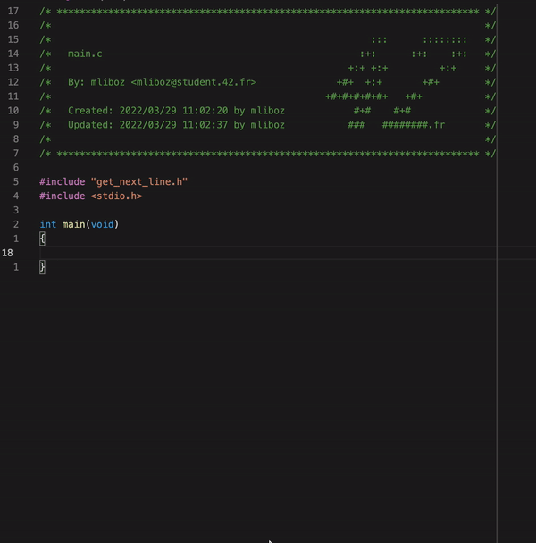
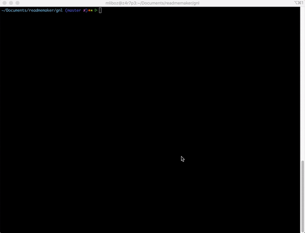

# Get_next_line project at 42 school

### Create a function that allow you to read a line from files.

The goal is to read line by line a file, at the end of the file the function should return NULL.</br>
This will allow you to loop until get_next_line return null.</br>
The bonus should allow you to handle reading several files at a same time.</br>

### What I learned:

* Use of open and read.
* Portect and free malloc
* Use of static variable


# Get next line
> Create a function that will print a line of a file

## Table of Contents
* [General Info](#general-information)
* [Technologies Used](#technologies-used)
* [Features](#features)
* [Use example](#use-example)
* [Setup](#setup)
* [Usage](#usage)
* [Project Status](#project-status)
* [Room for Improvement](#room-for-improvement)
* [Acknowledgements](#acknowledgements)
* [Contact](#contact)
<!-- * [License](#license) -->


## General Information
- The goal of this function is to get one line of a file, moreover this  
function can be call in a loop until the whole file is print.
- In C we don't have access to a function that allow you to read a file line by line,  
so we had to create one.
- The bonus part was to be able to print lines of different file simultaneously.
- I learned how to use the fcntl library, and how to use static variable.


## Technologies Used
- C

## Static variable

* What are they ? <br/>  
The concept of static variable is really important, and has specific use case.  
Indeed static variable lifetime is throughout the program run.  
It is declared like so: `static int i = 0;`  
The difference between this variable and a normal one is that its value persists  
across functions call.

* Why use them in this project ? <br/>  
We use them in this project to keep everything that is read by the buffer save.  
Indeed, we have to only print one line, but we can read more than one line.  
We then have to print the line until the '\n', and save the rest for the next call  
of get_next_line.


## Use example
* Main example <br/>  
 <br/> <br/> <br/>

* Compilation example <br/>


## Setup
There are no dependencies for this project.

First of all clone the repo inside your current working repository:
```
git clone https://github.com/MaxenceLiboz/42_get_next_line.git gnl
```

Then to compile:
```
gcc -Wall -Wextra -Werror main.c gnl/get_next_line.c gnl/get_next_line_utils.c -D BUFFER_SIZE=10
```
Note: You can replace the BUFFER_SIZE by any number between 0 and MAX_INT

## Project Status
The project is complete and turned in.

## Contact
Created by [@mliboz](https://github.com/MaxenceLiboz)