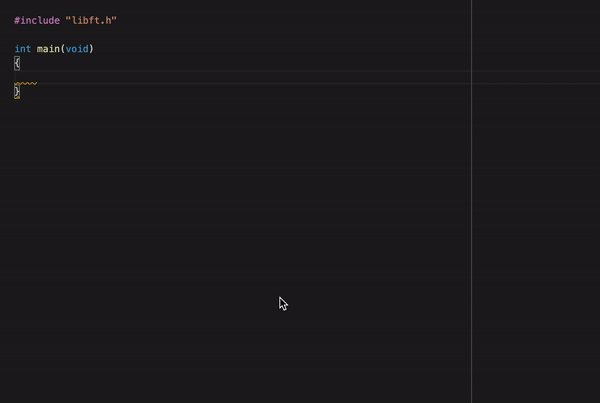

# Libft
> Create our own C library to use in other projects

## Table of Contents
- [Table of Contents](#table-of-contents)
- [General Information](#general-information)
- [Technologies Used](#technologies-used)
- [Use example](#use-example)
- [Setup](#setup)
- [Usage](#usage)
- [Project Status](#project-status)
- [Room for Improvement](#room-for-improvement)
- [Contact](#contact)


## General Information
- Create a library with C function that you often use.
- Thanks to this project you won't have to write your code again and again
- The purpose of this project is to save time.
- In order to use this functions again and again, they have to be as generic as possible.
<!-- You don't have to answer all the questions - just the ones relevant to your project. -->


## Technologies Used
- C
- Makefile

## Use example

<!-- If you have screenshots you'd like to share, include them here. -->


## Setup
There are no dependency for this project.

First of all clone the repo inside your current working repository:
```
git clone https://github.com/MaxenceLiboz/42_libft.git libft
```

Then:
```
make -C libft
```
```
cp libft/libft.a ./
```

Finally:
```
gcc -Wall -Wextra -Werror main.c libft.a
```

You can include this library to compile with your Makefile


## Usage
Inside your main.h:

`#include "./libft/libft.h"`

You can then use all the function in the library: [Use example](#use-example)


## Project Status
The project is complete and turned in.

## Room for Improvement

Room for improvement:
- Add up more checks for my functions
- Implement more function
- Structure the library differently to be clearer 


## Contact
Created by [@mliboz](https://github.com/MaxenceLiboz)
