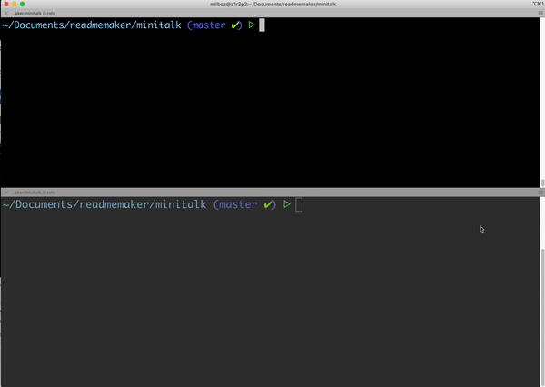

# Minitalk project at 42 school

### Create a server and a client

The goal of this project is to create a client that is able to comunicate to a server a string thanks to signals.
Two signals are allowed SIGSUR1 and SIGSUR2.
The way to comunicate the string between both is to convert every char in binary and send the binary. SIGSUR1 = 0 / SIGSUR2 = 1
The server get the binary send and convert back the char.

### What I learned:
* Using signals
* Comunicate between different programs


# Minitalk
> Create a client that communicate with a server throughout signals.

## Table of Contents
* [General Info](#general-information)
* [Technologies Used](#technologies-used)
* [Screenshots](#screenshots)
* [Setup](#setup)
* [Usage](#usage)
* [Project Status](#project-status)
* [Room for Improvement](#room-for-improvement)
* [Contact](#contact)
<!-- * [License](#license) -->


## General Information
- Two executable are created, one is the client, the other one is the server.
- The goal of this project is to learn how to use sginal to communicate with  
differents process (PID).
- In order to make that happen we could use only 2 signals, SIGSUR1 and SIGSUR2.  
Therefore, we had to comunicate with binary signal.

## Technologies Used
- C
- Makefile

## Screenshots

<!-- If you have screenshots you'd like to share, include them here. -->


## Setup
There are no dependencies for this project.

First of all clone the repo:
```
git clone https://github.com/MaxenceLiboz/42_minitalk.git minitalk
```

Then:
```
cd minitalk
```
```
make
```

Finally:
```
./server
```
```
./client [SERVER PID] [STRING TO SEND]
```

## Usage
The way this project work is that the server run in an infinite loop. At first,  
it print its PID.  
To run the server use: `./server`

Next you have to run client with two paramaters, the Server PID and the string to send.  
You should be able to see the string appear on the server side after running this command:  
`./client [PID SERVER] [STRING]`


## Project Status
The project is complete and turned in.

## Room for Improvement

Room for improvement:
- When a client send a signal, make all other client wait before it can send its string.
- When the server is done printing the string, send back a signal to the client.
- Being able to receive Unicode characters 

## Contact
Created by [@mliboz](https://github.com/MaxenceLiboz)
