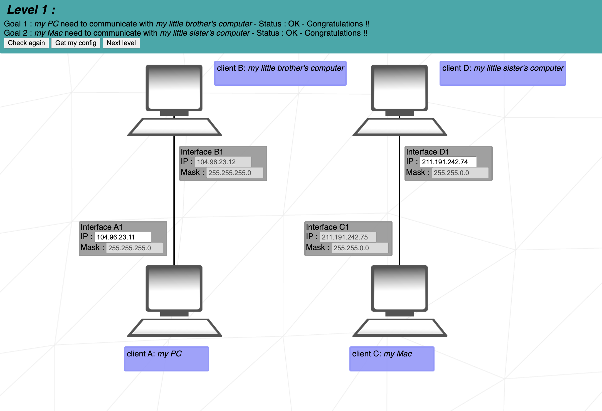
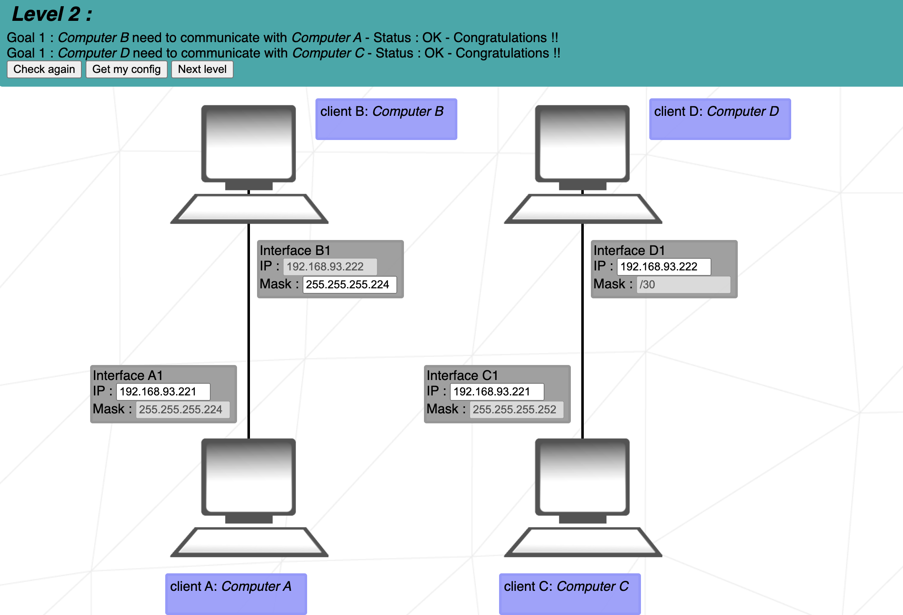
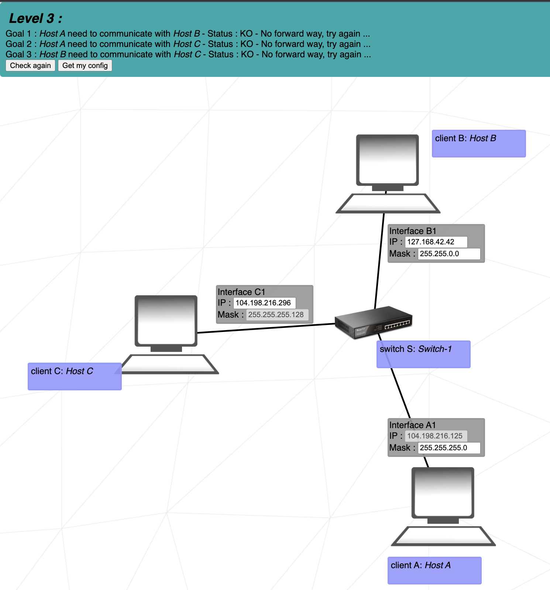
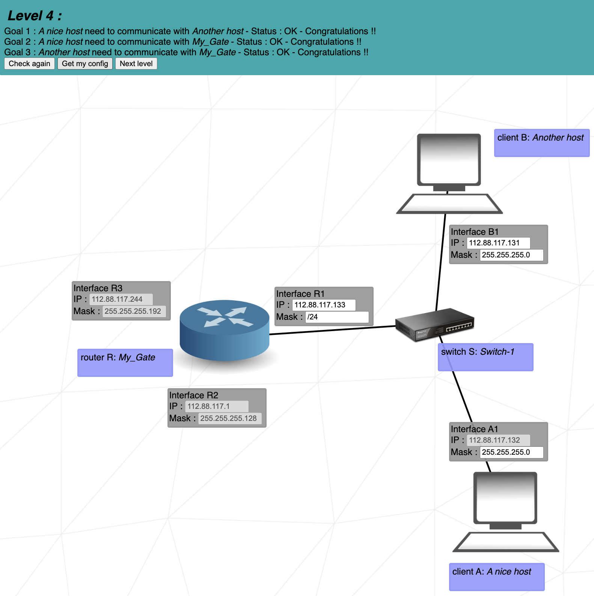
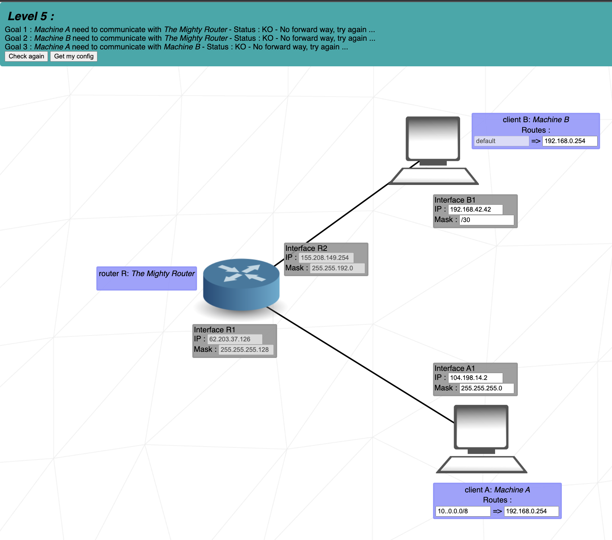
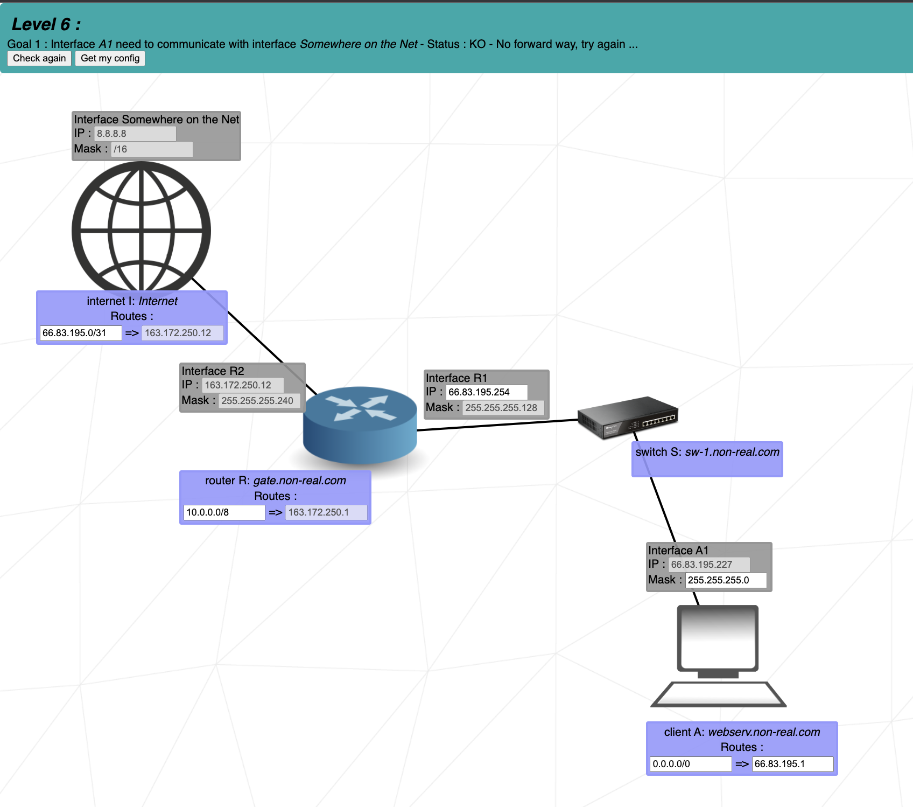
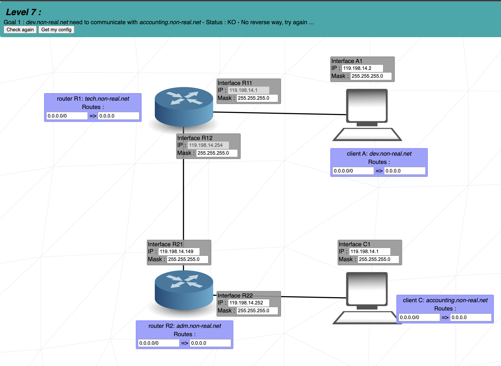
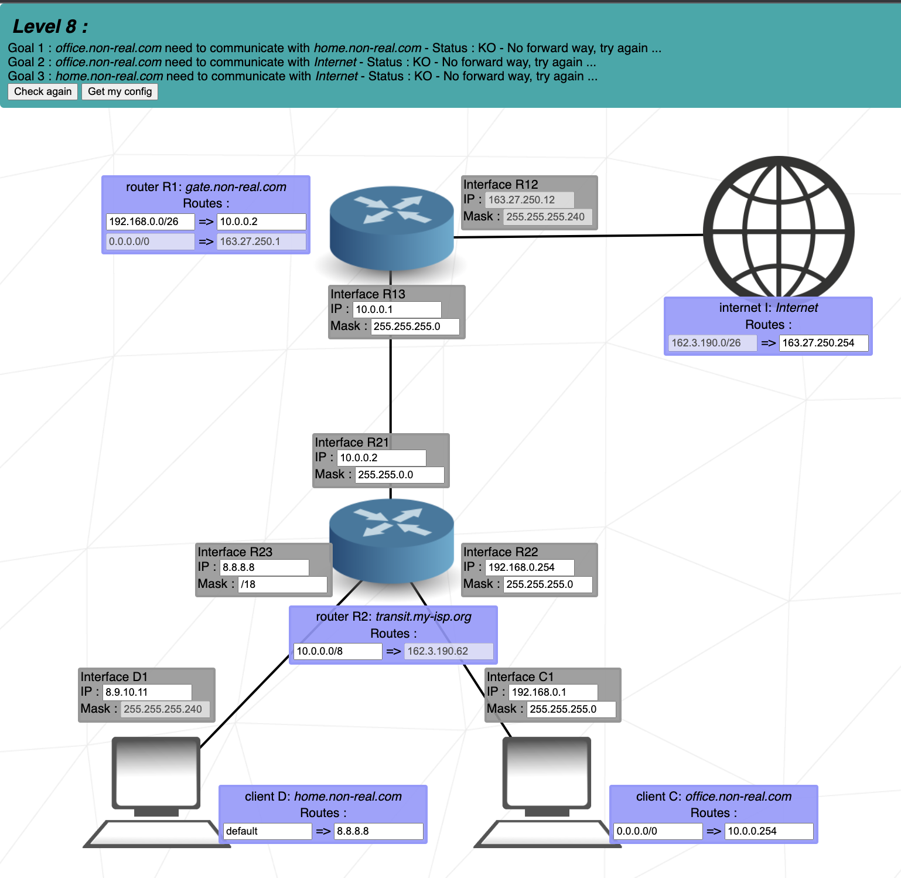
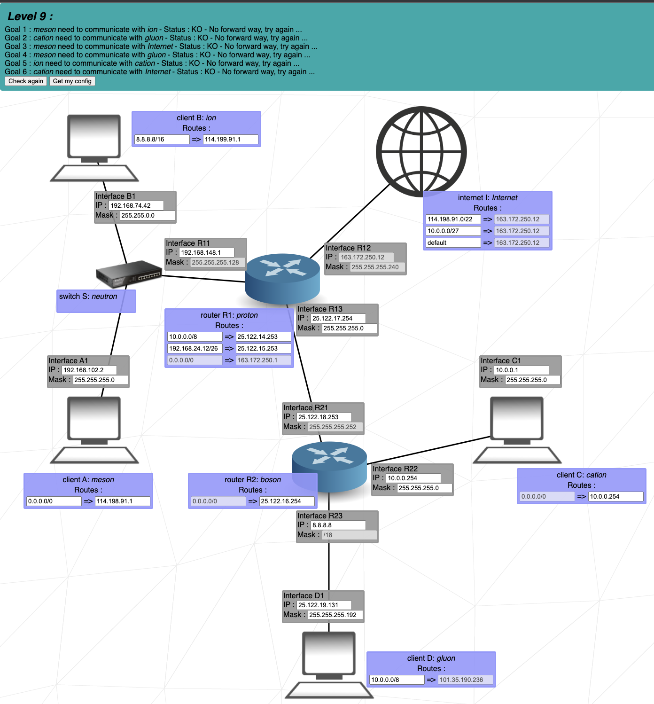
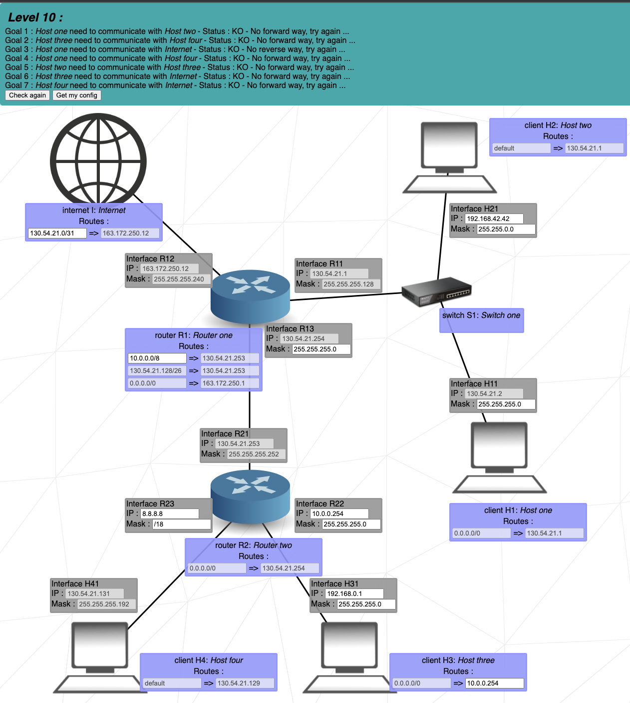

# NetPractice
> Learn about TCP/IP 

## Table of Contents
* [General Info](#general-information)
* [Levels](#levels)
* [Project Status](#project-status)
* [Contact](#contact)

## General Information
- For this project we have different type of infrastructure  
and we had to connect two interface between them or/and on the net etc.
- Check the link here to see all the [levels](#levels)

## Levels
- In the first level, we had to make comunication between two client in the same network.

      

- In the second level, we had to do the same than level 1, but we had an introduction to the mask.

      

- In the level 3, we now have 3 client to connect. All of them are connected to a switch.

      

- In this level 4, we had a brief introduction to interface, that will allow us to communicate to other network.

      

- In the level 5, we use this interface to make comunication between two client that are not on the same network. We have to create routes from clients to the interface.

      

- In the level 6, we have an introduction to comunication between a client and an interface somewhere on the net. We take the notion learned before between client to router. In order to make the way back from internet to the client, the internet interface need to create a route toward the client router.

      

- In the level 7, we deepen into router interface. Here, we have two router that comunicate between each other, and each one of them have a connection to a client. For client A and Client C to communicate they have to create a route to their router inteface. Then both router have themselves a route to communicate between each other.

      

- In the level 8, all we learned before is put into practice. We have to make 2 client communicate between them with an interface. Moreover they have to communicate with the an interface somewhere on the web.

      

- In the level 9, same as level 8, everything we have learn so far is put in application.

      

- The level ten look like the 9. It is a bit different but it put everything together from level 1 to level 7

      

## Project Status
The project is complited

## Contact
Created by [@mliboz](https://github.com/MaxenceLiboz/) - feel free to contact me!