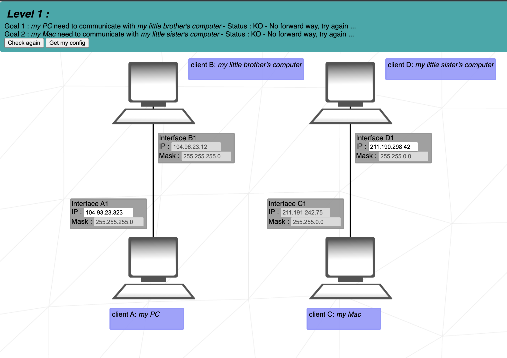
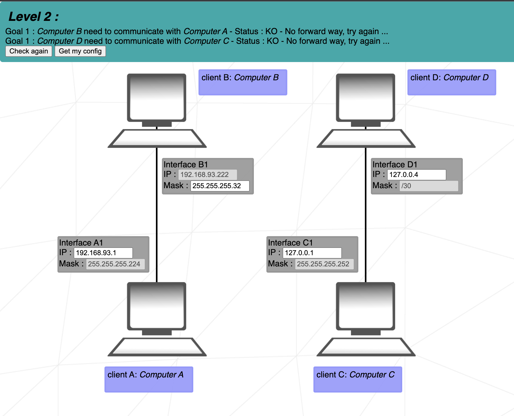

# NetPractice
> Learn about TCP/IP 

## Table of Contents
* [General Info](#general-information)
* [Network range and Mask](#network-range-and-mask)
* [Levels](#levels)
* [Project Status](#project-status)
* [Contact](#contact)

## General Information
- For this project we have different type of infrastructure  
and we had to connect two interface between them or/and on the net etc.
- Check the link here to see all the [levels](#levels)

## Network range and Mask

#### **When the Mask is easy, which means it ends with 0 we have:**
- The subnet number that is equal to 0
- The first host Ip adress equal to the subnet + 1
- The broadcast adress equal to 255 
- The last host Ip adress equal to the broadcast - 1

| Octets | 1 | 2 | 3 | 4 |
| -|-|-|-|-|
| Adress | 192 | 169 | 12 | 234 |
| Mask | 255 | 255 | 255 | 0 |
| Subnet | 192 | 169 | 12 | 0 |
| First | 192 | 169 | 12 | 1 |
| Broadcast | 192 | 169 | 12 | 255 |
| Last | 192 | 169 | 12 | 254 |

Therefore the range of Ip address that are usable is from `192.169.12.1` to `192.169.12.254`

With the same logic if the Mask would have been `255.255.0.0` the range of usable host Ip address would have been from `192.169.0.1` to `192.169.255.254`.

#### **For the rest of the masks**
If we take `255.255.255.128` as a Mask and `192.169.12.234` as on Ip adress in the range.

We then need to perform a `Binary AND` operation.

Every address converted to binary:  
| Octets | 1 | 2 | 3 | 4 |
|-|-|-|-|-|
| Ip address | 11000000 | 10101001 | 00001100 | 11101010 |
| Mask | 11111111 | 11111111 | 11111111 | 100000000 |
| AND | 11000000 | 10101001 | 00001100 | 10000000 |
| Subnet | 192 | 169 | 12 | 128 |
| First | 192 | 169 | 12 | 129 |
| Broadcast | 192 | 169 | 12 | 255 |
| Last | 192 | 169 | 12 | 254 |

- The subnet is find using an Binary AND operation with the Mask and the Ip address and convert it back.  
- The first is the subnet + 1
- The broadcast is the subnet + 256 - 128 (the mask) - 1. Soit 128 + 256 - 128 - 1 = `255`
- The last Ip is the broadcast - 1

Therefore the range of Ip address that are usable is from `192.169.12.129` to `192.169.12.254`

## Levels
In the first level, we had to make comunication between two client in the same network.

How to resolve level 1 ?

- Goal 1:  
We have to change the Interface A1 IP address to be between `104.96.23.1` and `104.96.23.254`. [Learn how](#network-range-and-mask) to get the range.

- Goal 2:  
We have to change the Interface D1 IP address to be between `211.191.0.1` and `211.191.255.254`. [Learn how](#network-range-and-mask) to get the range.

      

 

In the second level, we had to do the same than level 1, but we had an introduction to different type of masks.

  

How to resolve level 2 ?

- Goal 1:  
We have to change the Interface A1 IP address to be between `192.168.93.193` and `104.96.23.222`. [Learn how](#network-range-and-mask) to get the range.
We also have to give the same mask for both inteface. Therfore, we have in Interface B1 the mask `255.255.255.224` or `/27`. Click [here](#mask) to learn how to convert between one and the other

- Goal 2:  
We have to change the Interface D1 IP address to be between `192.168.94.193` and `192.168.94.194`. [Learn how](#network-range-and-mask) to get the range.

      

 

In the level 3, we now have 3 client to communicate with each other. All of them are connected to a switch.

How to resolve level 3 ?

- First of all we see that the mask of the network is `/25` or `255.255.255.128`. Moreover, we also know that the address `104.198.216.125` is in the network.
- Goal 1:  
We have to change both mask of Interface B1 and A1 to `/25`. [Learn more](#mask) about mask.
We alse have to change the Interface B1 IP address to be between `104.198.216.1` and `104.198.216.126`. [Learn how](#network-range-and-mask) to get the range.

- Goal 2 and 3:  
We have to change the Interface C1 IP address to be between `104.198.216.1` and `104.198.216.126`. [Learn how](#network-range-and-mask) to get the range.

      

 

In this level 4, we had a brief introduction to interface, that will allow us to communicate to other network.

How to resolve level 4 ?
  

The easiest for the mask is to be `/24` or `255.255.255.0`

We have to change both mask of Interface B1 and A1 to `/24`.[Learn more](#network-range-and-mask) about mask.

We alse have to change the Interface B1 IP address to be between `112.88.117.1` and `112.88.117.254`. [Learn how](#network-range-and-mask) to get the range.

All the goals should be resolved.

      

 

In the level 5, we use this interface to make comunication between two client that are not on the same network. We have to create routes from clients to the router.

How to resolve level 5 ?
  

- Goal 1:  
We can see that the Mask needs to be `/25` or `255.255.255.129`. Therefore, the Ip address needs to be from `62.203.37.1` to `62.203.37.128`.  
Finally we need to create a route from default to the Ip of the Router inteface 1: `62.203.37.126`.

- Goal 2 and 3:
We can see that the Mask needs to be `/18` or `255.255.192.0`. Therefore, the Ip address needs to be from `155.208.129.1` to `155.208.191.254`.  
Finally we need to create a route from default to the Ip of the Router inteface 2: `155.208.149.254`.

All the goals should be resolved.

      

 

In the level 6, we have an introduction to comunication between a client and an interface somewhere on the net. We take the notion learned before between client to router. In order to make the way back from internet to the client, the internet interface need to create a route toward the client router interface.

How to resolve level 6 ?
  

- Goal 1:  
First of all we need to create a communication between the client to the router interface. The mask needs to be `/25`. Therefore, the Ip address range is from `66.83.195.129` to `66.83.195.254`. Finally we create the route from default to the router Interface R1 Ip address.  
Then we need to put default for the Router R, because the Router need to create a route from itself to the internet subnetwork.  
Finally, in order for the Interface Somewhere on the Net to communicate back to the client it needs to create a route from the client subnetwork to the router. So for example: `66.83.195.226/32`.

      

 

In the level 7, we deepen into router interface. Here, we have two router that comunicate between each other, and each one of them have a connection to a client. For client A and Client C to communicate they have to create a route to their router inteface. Then both router have themselves a route to communicate between each other.

How to resolve level 7 ?
  

It is the same principle than the level 5, but we had one router.
- Goal 1:  
First of all we can see that 2 subnetwork start with `119.198.14` (R11 and R12). Therefore, the mask need to be more than `/24` in order to have to subnetwork that doesn't overpass each other.  
We choose `/25`. The Client A Ip address range is from `119.198.14.1` to `119.198.14.126`. A route from default to `119.198.14.1` is created.  
The second subnetwork between R12 and R21 have `/25` mask, Ip address range from `119.198.14.129` to `119.198.14.254`. A route R1 from default to R21 Ip adress is created, and for the going back a route R2 from default to R12 default Ip address.  
Finally we need to do the same as always create a communication between Client C to Router:  
Mask: `24`  
Ip address from `119.199.14.1` to `119.199.14.254`  
Route from default to R22 Ip address.

      

 

In the level 8, all we learned before is put into practice. We have to make 2 client communicate between them with an interface. Moreover they have to communicate with the an interface somewhere on the web.

How to resolve level 8 ?
  

We can see that the Internet send back information to `162.3.190.0/26` wich means that both client subnetwork need to start by `162.3.190`.
- Goal 1:  
The mask of Client D is `/28`, the Ip addresses of D1 and R23 need to be from `162.3.190.1` to `162.3.190.14`, and a route from default to R23 Ip address.  
We are going to choose for the mask of Client C `/28`, the Ip addresses of C1 and R22 need to be from `162.3.190.17` to `162.3.190.30`, and a route from default to R22 Ip address.  

- Goal 2 and 3:  
We are going to choose for the mask of Client C `/28`, the Ip addresses of R13 is `162.3.190.62` because of the route. R22 need to be from `162.3.190.49` to `162.3.190.62`. The route backward is from default to R21 Ip address.  
Finally Internet I route need to be from `162.3.190.0/26` to `163.27.250.12`

      

 

I will let you find out the last two levls, but with everything you've learned so far, you should find it !
Good luck

## Project Status
The project is complited

## Contact
Created by [@mliboz](https://github.com/MaxenceLiboz/) - feel free to contact me!
