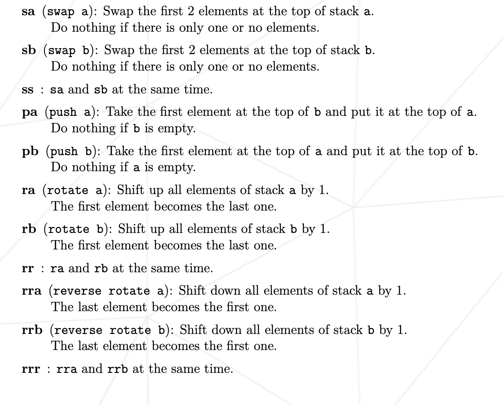
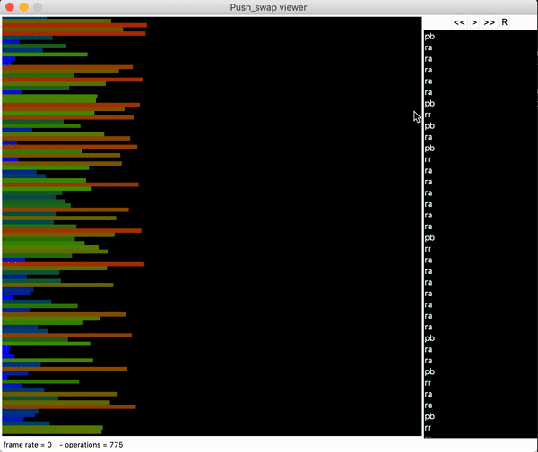

# Push_swap
> The principle of this project is to sort a list of number with the minimum number of iteration possible.

## Table of Contents
* [General Info](#general-information)
* [Technologies Used](#technologies-used)
* [Features](#features)
* [Screenshots](#screenshots)
* [Setup](#setup)
* [Usage](#usage)
* [Project Status](#project-status)
* [Room for Improvement](#room-for-improvement)
* [Contact](#contact)

## General Information
- For this project we get as parametters send, a list of number, in random order.  
We then need to parse the argument in a stack, I chose to use a list to represent a stack.
- The subject allowed us to use only two stack in order to sort the list number.
- As you can see [here](#screenshots), we must use several function to sort the list.
- The subject also asked use a maximum number of iteration depending on the size of the list:  
Maximum iteration for 3 numbers is 3  
Maximum iteration for 5 is 12  
Maximum iteration for 100 is -900 to get 80% grade  
Maximum iteration for 500 is -7000 to get 80% grade
- In order to do that, I use my own algorithm for 3/5/100 size list, and the radix  
algorithm for the 500 size list

## Technologies Used
- C
- Makefile

## Screenshots
Functions that we had to use <br/>  

 <br/> <br/> <br/>

Here is an example of the 100 size list algorithm shown thanks to a 
[push_swap viewer](https://github.com/o-reo/push_swap_visualizer) made by [@o-reo](https://github.com/o-reo)




## Setup
There are no dependencies for this project.

First of all, clone the repo:
```
git clone https://github.com/MaxenceLiboz/42_push_swap.git push_swap
```

Then:
```
cd push_swap
```
```
make
```

Finally:
```
./push_swap [LIST OF NUMBER] => [1 2 3 4 5]
```

## Usage
In order to use push_swap, enter a list of number as parameters like so:  
`./push_swap 10 2 -5 20 130`  


## Project Status
The project is done and turned in!


## Room for Improvement

Room for improvement:
- Get a better algorithm for the 100 size list to get 100% grade.
- Get a better algorithm for the 500 size list to get 100% grade.

## Contact
Created by [@mliboz](https://github.com/MaxenceLiboz)
